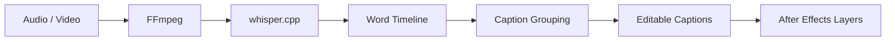

# AE Whisper Captions

AE Whisper Captions is a local AI subtitle and caption extension for Adobe After Effects. It uses `whisper.cpp` for offline speech-to-text transcription, supports real word-level timestamps, GPU/CUDA acceleration, Persian/Farsi transcription, and configurable caption grouping.

This repository is a stable baseline for word-timed local caption grouping. It does not include Word Highlight or karaoke-style active-word animation yet.

## What It Does

AE Whisper Captions turns local audio or video into editable subtitles for After Effects:

```text
Audio / Video -> FFmpeg -> whisper.cpp -> word-level timestamps -> caption grouping -> editable subtitles -> After Effects text layers
```

You can transcribe media locally, edit the captions in the panel, regroup captions without running transcription again, export SRT, or import subtitles into the active After Effects composition as text layers.

## Key Features

- Local/offline transcription workflow.
- `whisper.cpp` backend support.
- Optional `faster-whisper` backend for the earlier segment-level workflow.
- NVIDIA CUDA support when your `whisper.cpp` build supports CUDA.
- Real word-level timestamps from `whisper.cpp`.
- Persian/Farsi transcription support.
- RTL-safe grouping architecture that groups word records instead of reversing text or cutting Persian text at arbitrary positions.
- Configurable `Max Words`.
- Configurable `Max Characters`.
- Pause-based splitting with `Pause Split`.
- Duration-based splitting with `Max Duration` and `Min Duration`.
- Auto Segment can regroup captions from the saved master word timeline without retranscription.
- After Effects `Multiple Layers` import.
- SRT import and export.
- Draft save/open with separate `sourceWords` persistence.
- Fallback behavior for captions without word metadata.
- Adobe After Effects 2026 support through AEFT host range `[25.0,99.9]`.

## Why Word-Level Timing Matters

Older caption splitting often uses character counts and estimated timings. That can create unnatural subtitle fragments, especially in Persian/Farsi and other right-to-left text.

This version stores a master word timeline from `whisper.cpp`. Caption grouping uses the real start and end time of each spoken word. When you change grouping settings, the captions can be rebuilt from the same timeline without running Whisper again.

## Caption Grouping

The Caption Grouping controls define how word records are grouped into captions:

- `Max Words`: maximum words in one caption.
- `Max Characters`: maximum text length in one caption.
- `Pause Split`: split at long pauses between words.
- `Max Duration`: maximum caption duration.
- `Min Duration`: minimum caption duration where safe.

When `sourceWords` exists, pressing `Auto Segment` regroups captions from the master word timeline. It does not invoke Whisper and does not retranscribe the media.

## Persian / Farsi Support

Persian transcription works with the `whisper.cpp` workflow when a suitable Whisper model is selected and the language is set, for example `fa`.

The extension does not manually reverse Persian strings. Grouping works between validated word records. This avoids unsafe slicing inside Persian text. Mixed Persian/English text is supported by the transcription and grouping architecture, but transcription accuracy still depends on the selected model, audio quality, and language settings.

## Requirements

- Windows.
- Adobe After Effects with CEP extension support.
- Adobe After Effects 2026 is supported by the current manifest host range.
- FFmpeg for media conversion.
- `whisper.cpp` with `whisper-cli`.
- A local Whisper model file, for example a GGML model that matches your `whisper.cpp` build.
- Optional NVIDIA GPU and a CUDA-enabled `whisper.cpp` build for acceleration.
- Optional Python dependencies for legacy `faster-whisper`, vocal separation, or offline translation workflows.

This repository does not include Whisper models, media samples, API keys, or user cache files.

## Installation

1. Download or clone this repository.
2. Copy the extension folder to your CEP extensions directory:

   ```text
   C:\Users\<you>\AppData\Roaming\Adobe\CEP\extensions\AESpeechSubtitleAI
   ```

3. If CEP debug mode is not enabled, enable it for your Adobe/CEP version.
4. Restart After Effects.
5. Open `Window > Extensions > AE Subtitle AI Local`.
6. In the panel, set `Engine` to `whisper.cpp`.
7. Set `whisper.cpp Program` to your local executable, for example:

   ```text
   C:\path\to\whisper-cli.exe
   ```

8. Set `whisper.cpp Model` to your local model file, for example:

   ```text
   C:\path\to\ggml-large-v3-turbo.bin
   ```

9. Set `FFmpeg` to `ffmpeg` if it is on `PATH`, or select your local `ffmpeg.exe`.
10. For Persian/Farsi transcription, set `Language` to `fa`.

You can also use `INSTALL.cmd` from the project folder if you want the included installer script to copy the extension into the CEP extensions folder.

## Basic Usage

1. Open the extension in After Effects.
2. Select an audio or video file.
3. Choose `whisper.cpp`.
4. Select a Whisper model.
5. Set the language, for example `fa`.
6. Configure Caption Grouping.
7. Run `Local Transcribe`.
8. Edit captions if needed.
9. Change `Max Words` or other grouping controls if desired.
10. Run `Auto Segment` to regroup without retranscription.
11. Click `Import to After Effects`.

## Architecture



The application keeps two levels of word timing data:

- `sourceWords`: the master word timeline for the whole transcription.
- `caption.words`: the word metadata for one grouped caption.

`localServices.js` transcribes and normalizes the master word timeline. `localOptimizer.js` groups words into captions. The app state stores `sourceWords` once and stores only the relevant words on each caption.

## Current Status

`v0.1.0` is the stable baseline for local word-timed caption grouping. It includes After Effects 2026 compatibility, English UI, `whisper.cpp`, Persian/Farsi transcription, word-level timestamps, configurable grouping, SRT workflows, draft persistence, and AE Multiple Layers import.

This version does not include Word Highlight, active-word color animation, or karaoke-style highlighting.

## Roadmap

- Word Highlight.
- Active-word color.
- Active-word scale/pop.
- Caption presets.
- Additional animation styles.
- Richer RTL/Persian typography controls.
- `faster-whisper` word timing support.

## Screenshots

Screenshots are not included yet.

## Privacy

The local `whisper.cpp` workflow can run transcription on your machine. It does not require sending audio to a cloud speech API.

Do review any optional tools that you add yourself, such as translation packages or external processing scripts.

## Upstream / Attribution

This project is based on and derived from [`FangYeBai/AE-Subtitle-AI-Local`](https://github.com/FangYeBai/AE-Subtitle-AI-Local).

The original project is Copyright (c) 2026 FangYeBai and is licensed under the MIT License. Enhancements in this repository are maintained separately.

## License

MIT License. See [LICENSE](LICENSE).
